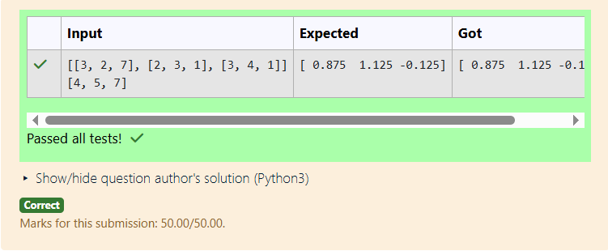

# EX5-LU Decomposition 

## AIM:
To write a program to find the LU Decomposition of a matrix.

## Equipments Required:
1. Hardware – PCs
2. Anaconda – Python 3.7 Installation / Moodle-Code Runner

## Algorithm:
### Step 1:
Import the numpy module and the lu function from the scipy.linalg library.
### Step 2:
Get the matrix input from the user and assign it to a variable using np.array().
### Step 3:
Using the lu() function, perform LU decomposition to obtain the matrices P, L, and U.
### Step 4:
Display the L and U matrices.
### Step 5:
End the program.

## Program:
(i) To find the L and U matrix
```
/*
Program to find the L and U matrix.
Developed by: 
RegisterNumber: 
*/
```
(ii) To find the LU Decomposition of a matrix
```
/*
Program to find the LU Decomposition of a matrix.
Developed by: 
RegisterNumber: 
*/
```

## Output:



## Result:
Thus the program to find the LU Decomposition of a matrix is written and verified using python programming.

